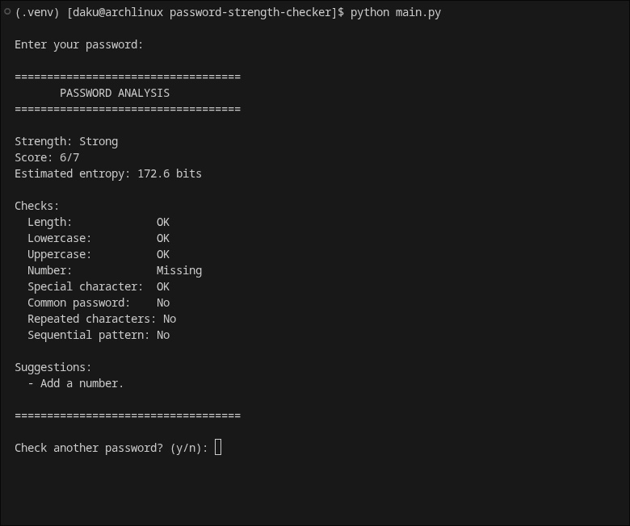

# Password Strength Checker

A simple command-line password strength checker written in Python.

The program analyzes a password using several different checks and provides a strength score, an estimated entropy value, and suggestions for improvement.

## Demo 

### Screenshot



### Video 

[Watch demo](https://github.com/user-attachments/assets/9050818a-ccc6-47d8-ad5d-c89de6f59065)

## Features

- Checks password length
- Checks for lowercase letters
- Checks for uppercase letters
- Checks for numbers
- Checks for special characters
- Detects common passwords
- Detects repeated characters
- Detects predictable sequences
- Calculates a strength score
- Estimates password entropy
- Provides suggestions for improving weak passwords
- Allows multiple passwords to be checked in one session
- Includes automated tests using Python's built-in `unittest`

## Requirements

- Python 3
- No external Python packages are required

## Running the program

Clone the repository:

```bash
git clone https://github.com/dakugaming7487/password-strength-checker.git
cd password-strength-checker
```

Run the program:

```bash
python main.py
```

The password is entered using `getpass`, so it is not displayed while being typed.

## Running the tests

Run the automated test suite with:

```bash
python -m unittest
```

The test suite covers the main password-checking functions.

## Strength scoring

The checker uses a maximum score of 7 points:

| Check | Points |
|---|---:|
| Length | 0–3 |
| Lowercase | 1 |
| Uppercase | 1 |
| Number | 1 |
| Special character | 1 |

Additional security checks can reduce the score:

- Common password: -2
- Repeated characters: -1
- Sequential pattern: -1

The final score cannot go below 0.

Passwords shorter than 8 characters are classified as **Weak** regardless of their score.

## Entropy estimate

The program also provides an estimated entropy value based on the password's length and the types of characters it contains.

This is only an estimate. It assumes characters are selected approximately randomly from the detected character sets.

A high entropy value does **not** guarantee that a human-created password is secure, which is why the program also checks for common passwords and predictable patterns.

## Example

```text
===================================
       PASSWORD ANALYSIS
===================================

Strength: Strong
Score: 6/7
Estimated entropy: 78.7 bits

Checks:
  Length:             OK
  Lowercase:          OK
  Uppercase:          OK
  Number:             OK
  Special character:  OK
  Common password:    No
  Repeated characters: No
  Sequential pattern: No

Suggestions:
  - No obvious issues detected.

===================================
```

## Project structure

```text
password-strength-checker/
├── main.py
├── test_main.py
└── README.md
```

## Disclaimer

This project is intended for learning and demonstration purposes.

The checker uses a collection of simple rules and heuristics. It cannot guarantee that a password is secure.

Passwords should not be stored or shared unnecessarily.